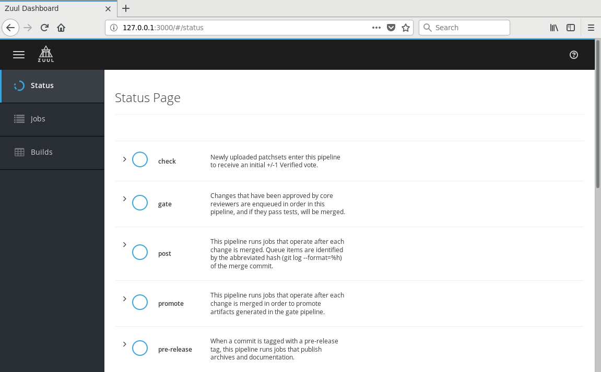
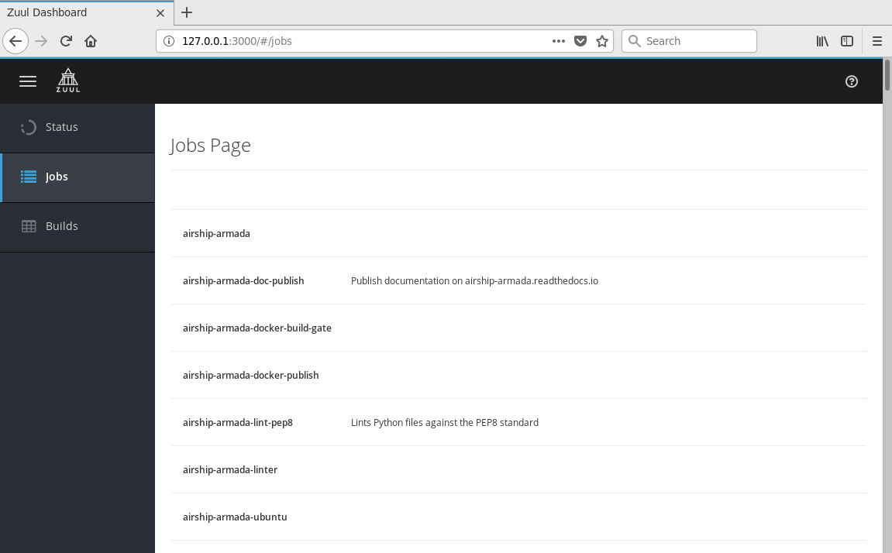
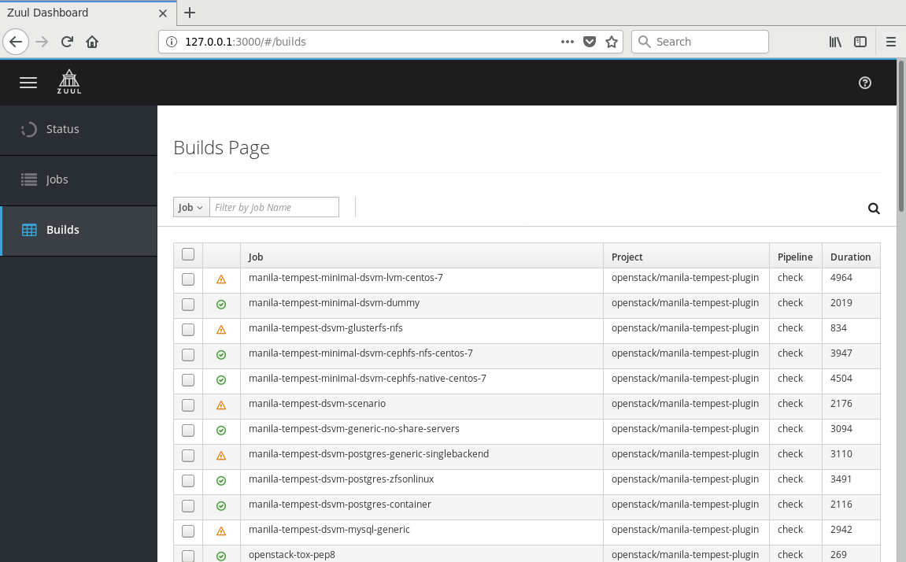

# zuul-ui

This is a draft experiment to build Zuul UI using react+patternfly

Run the following commands:

```
yarn install
yarn build
REACT_APP_API_ROOT=https://zuul.openstack.org/api yarn start
```








## TODO

* ChangeQueue component
* Builds table fix (pagination and filters are not working)
* Context (multi-tenancy info get thing)
